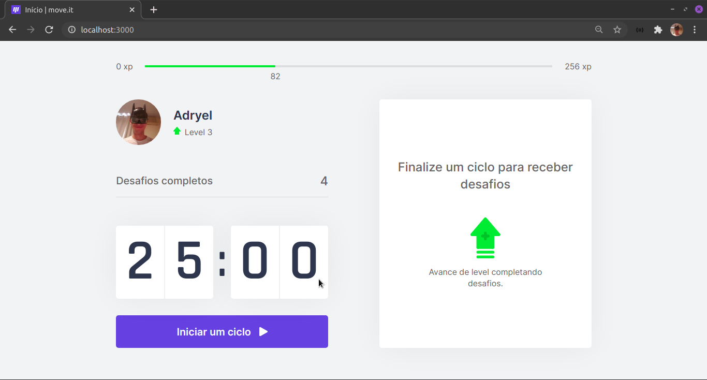
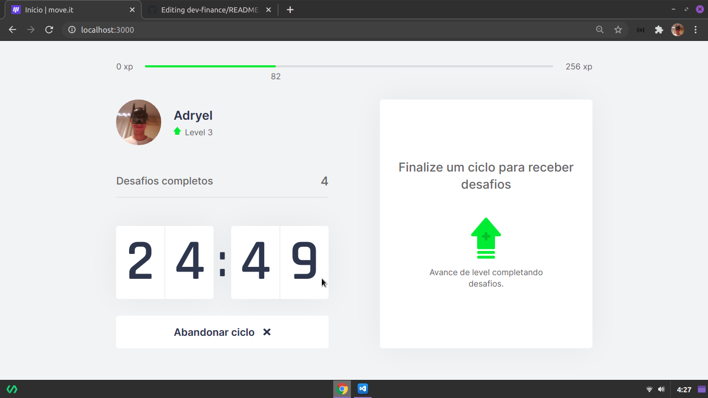
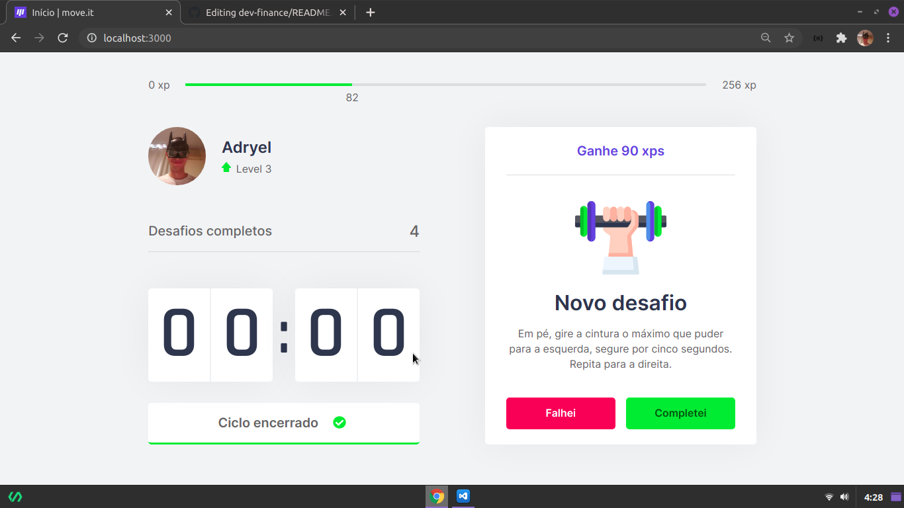
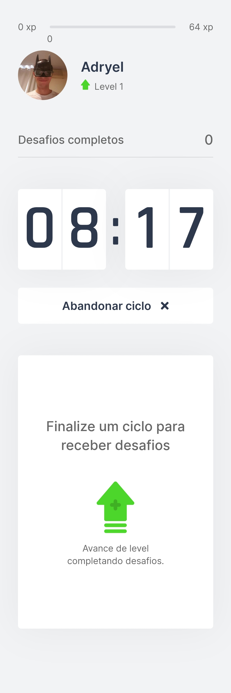

# Move.it
Projeto criado na quarta NLW

## Screenshots
Que tal dar uma olhada em como o projeto ficou?

## Rodando a aplicação:

1) Clone esse repositório

2) Na pasta, use o comando `yarn` para instalar as dependências. (Nota: caso prefira usar o npm, primeiro apague o arquivo yarn.lock e então execute o comando npm install.)

3) Execute o comando `yarn dev` para rodar um servidor local. O react deve abrir automaticamente o navegador no endereço `localhost:3000`